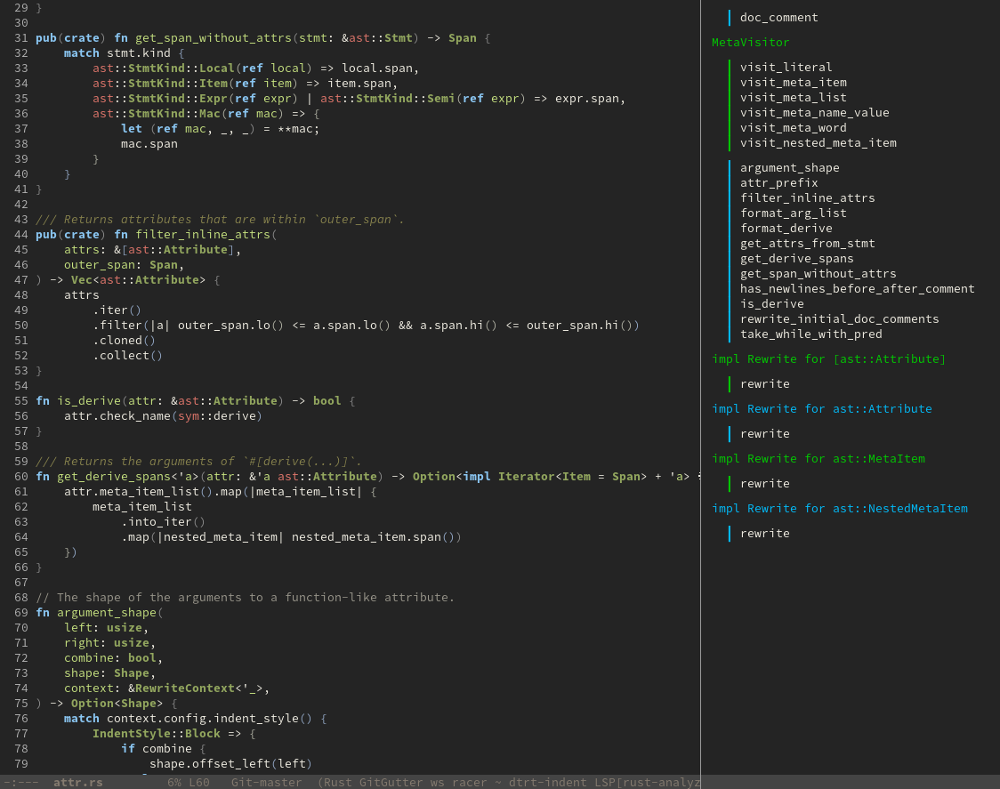

lsp-ui
======

[](https://melpa.org/#/lsp-ui)
[](https://stable.melpa.org/#/lsp-ui)
[](https://discord.gg/swuxy5AAgT)
[](https://github.com/emacs-lsp/lsp-ui/actions)

<!-- markdown-toc start - Don't edit this section. Run M-x markdown-toc-refresh-toc -->
**Table of Contents**

- [lsp-ui](#lsp-ui)
    - [Intro](#intro)
    - [lsp-ui-sideline:](#lsp-ui-sideline)
    - [lsp-ui-peek:](#lsp-ui-peek)
    - [lsp-ui-doc](#lsp-ui-doc)
    - [lsp-ui-imenu](#lsp-ui-imenu)
    - [Contributing](#contributing)

<!-- markdown-toc end -->

## Intro

This package contains all the higher level UI modules of `lsp-mode`, like flycheck support and code lenses.

By default, `lsp-mode` automatically activates `lsp-ui` unless `lsp-auto-configure` is set to `nil`.

You only have to put `(use-package lsp-ui)` in your config and the package will work out of the box.
([use-package](https://github.com/jwiegley/use-package))

Or use the builtin package manager.

```
M-x package-install [RET] lsp-ui [RET]
```

## lsp-ui-sideline:

Show informations of the symbols on the current line.
It also show flycheck diagnostics and LSP code actions


Customization:

- `lsp-ui-sideline-show-diagnostics` show diagnostics messages in sideline
- `lsp-ui-sideline-show-hover` show hover messages in sideline
- `lsp-ui-sideline-show-code-actions` show code actions in sideline
- `lsp-ui-sideline-update-mode`
When set to 'line' the information will be updated when user
changes current line otherwise the information will be updated
when user changes current point
- `lsp-ui-sideline-delay` seconds to wait before showing sideline

## lsp-ui-peek:

Add [peek](https://code.visualstudio.com/docs/editor/editingevolved#_peek) feature


You may remap `xref-find-{definitions,references}` (bound to <kbd>M-.</kbd> <kbd>M-?</kbd> by default):

```elisp
(define-key lsp-ui-mode-map [remap xref-find-definitions] #'lsp-ui-peek-find-definitions)
(define-key lsp-ui-mode-map [remap xref-find-references] #'lsp-ui-peek-find-references)
```

There is a window-local jump list dedicated to cross references:
```elisp
(lsp-ui-peek-jump-backward)
(lsp-ui-peek-jump-forward)
```

Other cross references:
```elisp
(lsp-ui-peek-find-workspace-symbol "pattern 0")
;; If the server supports custom cross references
(lsp-ui-peek-find-custom 'base "$cquery/base")
```

Customization:

- `lsp-ui-peek-enable` enable ‘lsp-ui-peek’
- `lsp-ui-peek-show-directory` show the directory of files

## lsp-ui-doc

Show object documentation at point in a child frame.


Show documentation in a WebKit widget


Focus into lsp-ui-doc-frame


Customization:

- `lsp-ui-doc-enable` enable lsp-ui-doc
- `lsp-ui-doc-position` Where to display the doc
- `lsp-ui-doc-delay` Number of seconds before showing the doc
- `lsp-ui-doc-show-with-cursor` When non-nil, move the cursor over a symbol to show the doc
- `lsp-ui-doc-show-with-mouse` When non-nil, move the mouse pointer over a symbol to show the doc

## lsp-ui-imenu

Show imenu entries.



Customization:

- `lsp-ui-imenu-kind-position` place to show entries kind
- `lsp-ui-imenu-buffer-position` place to show the buffer window
- `lsp-ui-imenu-window-width` set window width
- `lsp-ui-imenu-window-fix-width` when non-nil, the window will not be resizable (eg. unaffected by `balance-windows`)
- `lsp-ui-imenu--custom-mode-line-format` mode line format
- `lsp-ui-imenu-auto-refresh` auto refresh when necessary
- `lsp-ui-imenu-refresh-delay` delay to refresh imenu

## Contributing

Any kind of help is appreciated. If you want to help us maintaining this package,
[leave a note](https://github.com/emacs-lsp/lsp-ui/issues/332).
