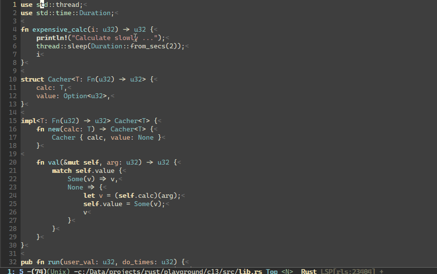

# lsp-ui

[](https://melpa.org/#/lsp-ui)
[](https://travis-ci.com/emacs-lsp/lsp-ui)

<!-- markdown-toc start - Don't edit this section. Run M-x markdown-toc-refresh-toc -->
**Table of Contents**

- [Intro](#intro)
- [lsp-ui-sideline:](#lsp-ui-sideline)
- [lsp-ui-peek:](#lsp-ui-peek)
- [lsp-ui-doc](#lsp-ui-doc)

<!-- markdown-toc end -->

# Intro

This package contains all the higher level UI modules of `lsp-mode`, like flycheck support and code lenses.

By default, `lsp-mode` automatically activates `lsp-ui` unless `lsp-auto-configure` is set to `nil`.

You only have to put `(use-package lsp-ui)` in your config and the package will work out of the box.
([use-package](https://github.com/jwiegley/use-package))

Or use the builtin package manager.

```
M-x ~package-install~ [RET] ~lsp-ui~ [RET]
```

# lsp-ui-sideline:

Show informations of the symbols on the current line.
It also show flycheck diagnostics and LSP code actions


# lsp-ui-peek:

Add [peek](https://code.visualstudio.com/docs/editor/editingevolved#_peek) feature


You may remap `xref-find-{definitions,references}` (bound to <kbd>M-.</kbd> <kbd>M-?</kbd> by default):

```elisp
(define-key lsp-ui-mode-map [remap xref-find-definitions] #'lsp-ui-peek-find-definitions)
(define-key lsp-ui-mode-map [remap xref-find-references] #'lsp-ui-peek-find-references)
```

There is a window-local jump list dedicated to cross references:
```elisp
(lsp-ui-peek-jump-backward)
(lsp-ui-peek-jump-forward)
```

Other cross references:
```elisp
(lsp-ui-peek-find-workspace-symbol "pattern 0")
;; If the server supports custom cross references
(lsp-ui-peek-find-custom 'base "$cquery/base")
```

# lsp-ui-doc

Show object documentation at point in a child frame.


Show documentation in a WebKit widget


Focus into lsp-ui-doc-frame

