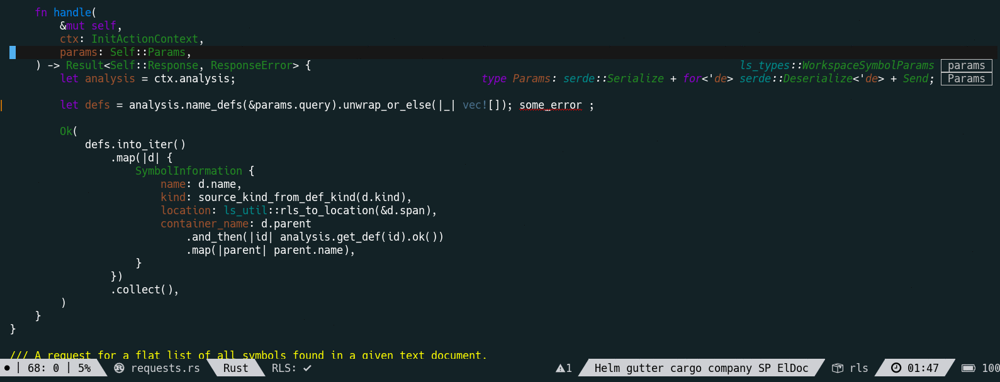
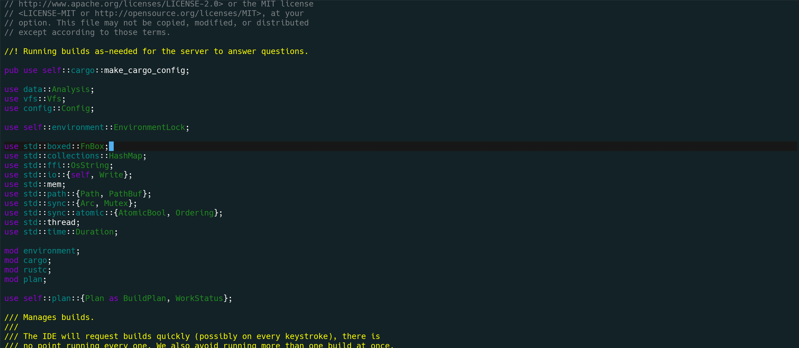
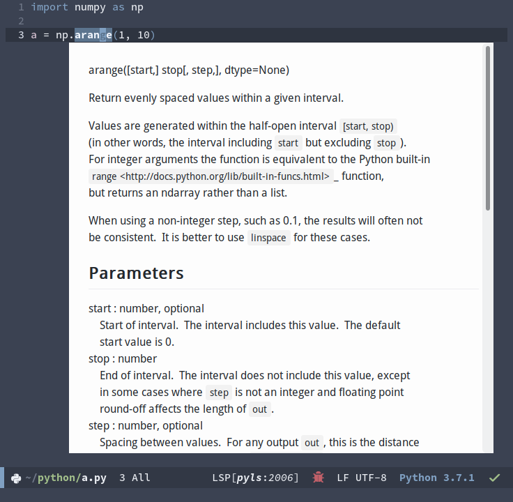

[](https://melpa.org/#/lsp-ui)

# lsp-ui

This contains all the higher level UI modules of `lsp-mode`, like flycheck support and code lenses.

More info to follow.

To enable the package and its features:

``` el
(require 'lsp-ui)
(add-hook 'lsp-mode-hook 'lsp-ui-mode)
```

To enable `flycheck-mode` for a particular LSP client, add the following

```el
(add-hook 'XXXXX-mode-hook 'flycheck-mode)
```

Otherwise the flycheck diagnostics will not be rendered.


To customize:  
`M-x customize-group [RET] lsp-ui [RET]`   

### lsp-ui-sideline:
Show informations of the symbols on the current line.  
It also show flycheck diagnostics and LSP code actions  


### lsp-ui-peek:
Add [peek](https://code.visualstudio.com/docs/editor/editingevolved#_peek) feature  


You may remap `xref-find-{definitions,references}` (bound to <kbd>M-.</kbd> <kbd>M-?</kbd> by default):

```elisp
(define-key lsp-ui-mode-map [remap xref-find-definitions] #'lsp-ui-peek-find-definitions)
(define-key lsp-ui-mode-map [remap xref-find-references] #'lsp-ui-peek-find-references)
```

There is a window-local jump list dedicated to cross references:
```elisp
(lsp-ui-peek-jump-backward)
(lsp-ui-peek-jump-forward)
```

Other cross references:
```elisp
(lsp-ui-peek-find-workspace-symbol "pattern 0")
;; If the server supports custom cross references
(lsp-ui-peek-find-custom 'base "$cquery/base")
```

### lsp-ui-imenu:

### lsp-ui-doc:
Show object documentation at point in a child frame.  


Show documentation in a WebKit widget

